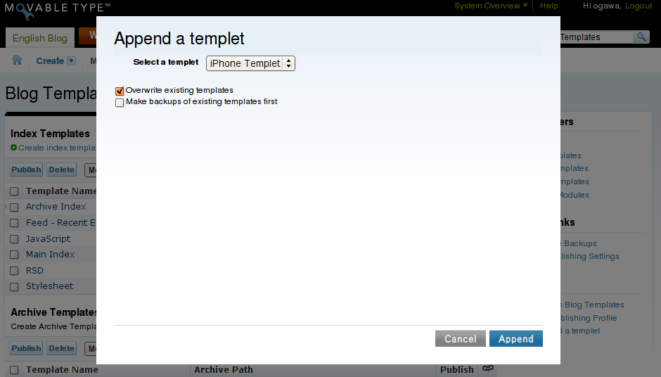

# Templets Plugin

Pluggableなテンプレートセット機能を実現するプラグイン。MT4以降専用。

## 更新履歴

 * 0.01 (2008-08-21 18:15:16 +0900):
   * Initial release.

## 概要

Templetsプラグインは、「テンプレット(プラガブルなテンプレートセット)」を実現します。このプラグインを使うことで、新しいテンプレートをインストール・管理するのがごく直感的かつ柔軟になります。

Templetsプラグインによって、

 - ユーザが、iPhone・携帯電話用テンプレット、ウィジェットテンプレートライブラリのテンプレット、ActionStream用のテンプレットなどさまざまなテンプレットを追加していくことで、自分のテンプレートセットを簡単にカスタマイズできるようになります。

 - テンプレートデザイナーが、自身の作ったテンプレートを簡単にパッケージして配布できるようになります。
 - プラグイン開発者が、新しいテンプレートタグを実現するプラグインを、サンプルテンプレートと一緒にパッケージして配布できるようになります。

これまではテンプレートをインストールしたり更新したりする作業は、大量のカット＆ペーストを必要とする面倒くさい作業でした。しかし、これからはTempletsプラグインがどんなテンプレートをインストールするのにも「ワンタッチ(死語)」で済むようにします。

## インストール

 1. Templets-_version_.zipファイルをダウンロードし、展開します。
 1. Templets-_version_/plugins ディレクトリの内容を、Movable Typeのpluginsディレクトリにアップロードまたはコピーします。
    注: Templets-_version_/plugins/MyTempletディレクトリにはサンプルテンプレットが入っています。サンプルが不要ならアップロードする必要はありません。
 1. インストールが正常に済めば、「システムプラグイン設定」の画面で「Templets」プラグインが確認できるでしょう。

## 使い方

現在のところ、Templetsプラグインは、テンプレットを現在のテンプレートセットに追加するというただ一つの機能を提供しています。

 1. [一覧]->[テンプレート]で「ブログのテンプレート」画面を開き、右下のアクションリストにある「テンプレットを追加」を選択します。
 1. インストール可能なテンプレットのドロップダウンリストの中からテンプレットを一つ選択します。ここで、選択したテンプレットで既存のテンプレートを上書きする場合には「既存のテンプレートを上書きする」をチェックします。また、上書きされるテンプレートをあらかじめバックアップしておく場合には「既存のテンプレートのバックアップを作成する」をチェックします。
 1. それが済んだら「追加」ボタンをクリックします。
 1. 無事に追加が済むと、自動的に元の「ブログのテンプレート」画面に遷移します。テンプレットに含まれるテンプレートがインストールされていることが確認できるでしょう。

## テンプレットについて

このプラグインには、MyTempletという名前のサンプルテンプレットしか含まれていません。

他のテンプレットを自分のテンプレートセットにプラグインして利用するには、別途サードパーティなどで配布しているテンプレットプラグインをダウンロードするか、自分自身でテンプレットプラグインを作成する必要があります。

テンプレット開発者向けに、[テンプレット開発者ガイド](DevelopersGuide.md)では、テンプレットプラグインの作成方法について説明しています。

## See Also

## License

Copyright (c) 2008 Hirotaka Ogawa <hirotaka.ogawa at gmail.com>.
All rights reserved.

This library is free software; you can redistribute it and/or modify
it under the terms of either:

 * the GNU General Public License as published by the Free Software Foundation; either version 1, or (at your option) any later version, or
 * the "Artistic License" which comes with Perl.