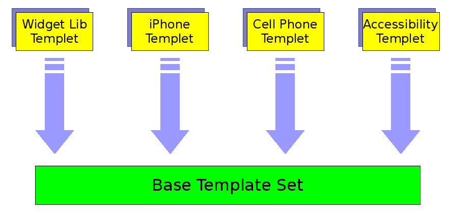
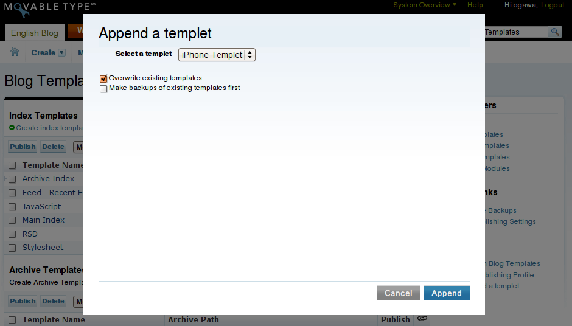

# Templets Plugin

A plugin for making Template Sets pluggable. Dedicated to MT4+.

## Changes

 * 0.01 (2008-08-21 18:15:16 +0900):
   * Initial release.

## Overview

Templets plugin realizes "pluggable template sets" called "templet",
and allows you to install and manage new templates very
straightforwardly and flexibly.

Templets plugin makes it easier:

 - For users to customize their base template sets by plugging in
   various kinds of templets, such as iPhone/cellphone templet, widget
   template library templet, and !ActionStream templet if available.

 - For template designers to package and distribute their own
   templates.
 - For plugin developers to package and distribute sample templates
   that use newly implemented template tags, into their plugins.

Until now, installing and updating templates have been a bothersome
task with a lot of cut-and-paste.  But from now, Templets provides a
"turn-key" solution to install any templates into your blogs.

## Installation

 1. Download and extract Templets-_version_.zip file.
 1. Upload or copy the contents of "Templets-_version_/plugins" directory into your MT "plugins" directory.
    NOTE: "Templets-_version_/plugins/MyTemplet" is an example templet.  If not required, you don't need to upload this.
 1. After proper installation, you will find "Templets" plugin listed on the "System Plugin Settings" screen.

## How to use

Currently, Templets plugin provides just one feature that is for appending a templet to current template set.

 1. Go to [Design]->[Templates] and then choose the [Append a templet] link from the "Action" list, which is located lower-right of the page.
 1. Choose a templet from the drop-down box if available.  If you want to overwrite existing templates by selected templet, check [Overwrite existing templates] box.  And if you want to make backups for existing templates which may be overwritten, check [Make backups of existing templates first] box.
 1. Then click [Append].
 1. You'll move to [Design]->[Templates] screen and find templates which are included in the templet. 

## Templet

This plugin only includes an example templet named "MyTemplet".

If you'd like to plug and use other templets in your template set, you have to separately download templet implementations from third-party or to create your own templet implementations.

For templet developers, [Developer's Guide](DevelopersGuide_en.md) will explain how they can implement templet plugins so easily.

## See Also

## License

Copyright (c) 2008 Hirotaka Ogawa <hirotaka.ogawa at gmail.com>.
All rights reserved.

This library is free software; you can redistribute it and/or modify
it under the terms of either:

 * the GNU General Public License as published by the Free Software Foundation; either version 1, or (at your option) any later version, or
 * the "Artistic License" which comes with Perl.